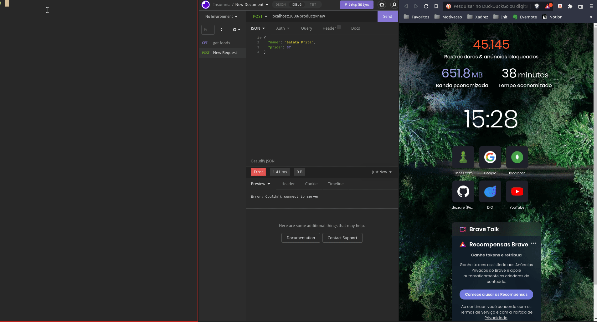

#Restaurant Ordering System

*This project is a work in progress.*

Project to improve some skills:
  - Docker
  - MongoDB
  - TypeScript
  - NodeJS
  - Express
  - mongoose

________________________________
## How to Setup
  - install NodeJS
  - install Docker
  - clone this repo
  - run 'docker compose up --build'
  - (TODO)open 'localhost:3000' for access the GUI app
  - open 'localhost:8081' for access mongo-express

